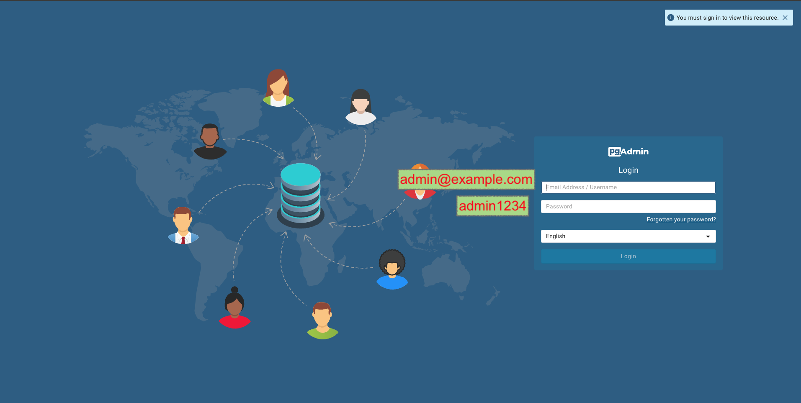
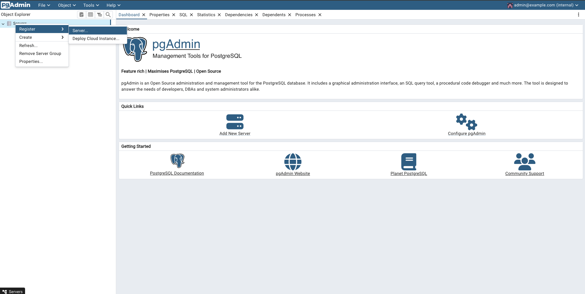
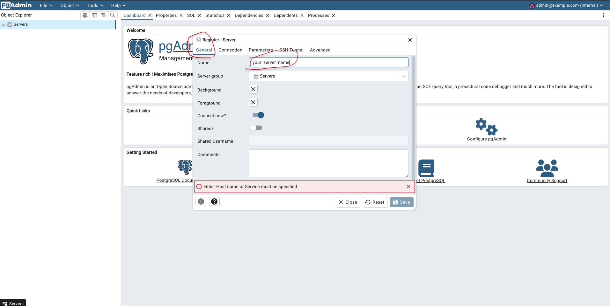
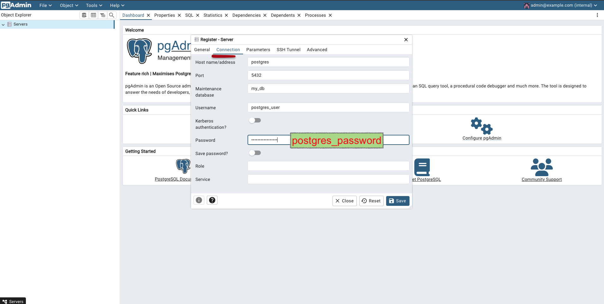
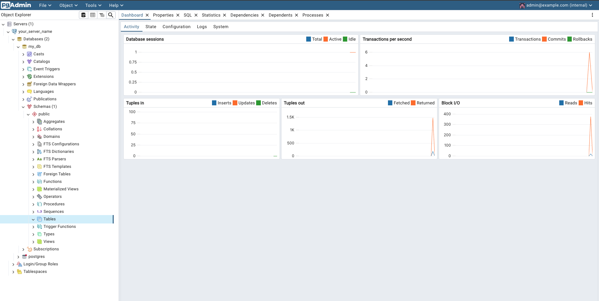
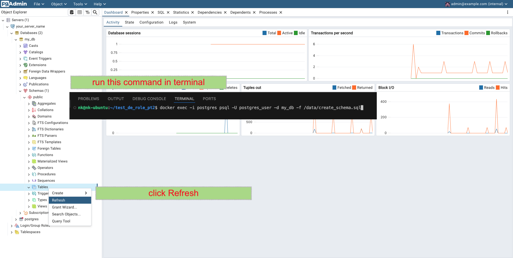
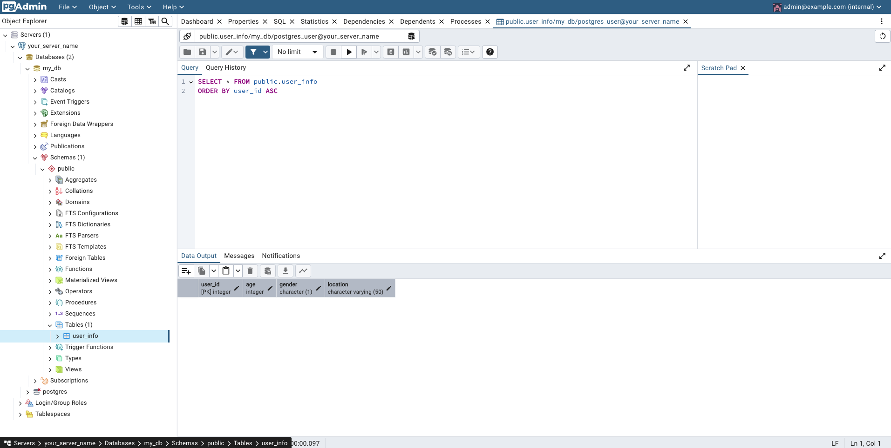
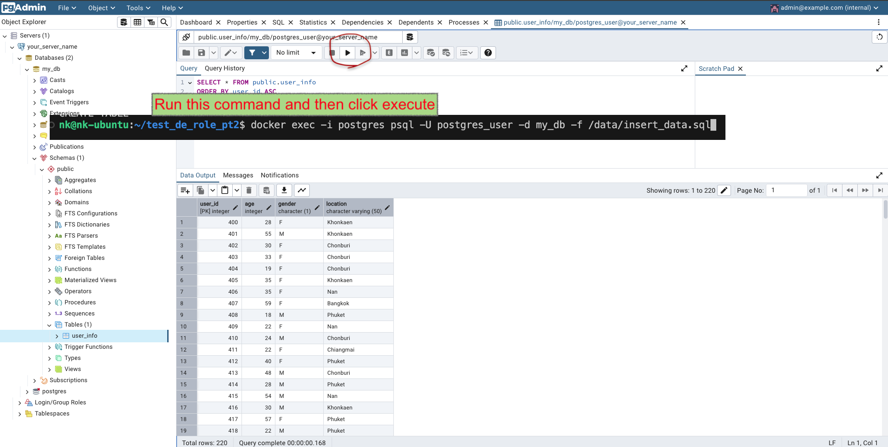

# Data Engineer Tests Part2

This project includes SQL scripts to create a table and insert data into the table. It uses **Docker** to simplify the setup process, ensuring a consistent and portable environment for all users.

**Note**: If you don't have Docker installed, you can head over to the [Get Docker](https://docs.docker.com/get-docker/) page for installation instructions.

## Getting Started

### 1. Clone the repository
```
git clone https://github.com/norasit/test_de_role_pt2.git
```
```
cd test_de_role_pt2
```

### 2. Using Docker
**Build and Start the Docker services**
1. Start the services (PostgreSQL and pgAdmin) by running:
```
docker compose up --build
```


2. Access pgAdmin:
- Open your browser and go to [http://localhost:5050](http://localhost:5050)
- **Login** using the credentials:
  - **Email**: `admin@example.com`
  - **Password**: `admin1234`







### 3. Running SQL Scripts
Run these commands in the terminal to execute a specific SQL script inside the Docker container:

1. **Create the table**:

```
docker exec -i postgres psql -U postgres_user -d my_db -f /data/create_schema.sql
```




2. **Insert data from 'user_info.csv' into the table**:

```
docker exec -i postgres psql -U postgres_user -d my_db -f /data/insert_data.sql
```



**Note**: The above commands assume you are using the default database `my_db`, which is created automatically by Docker when you start the services.
